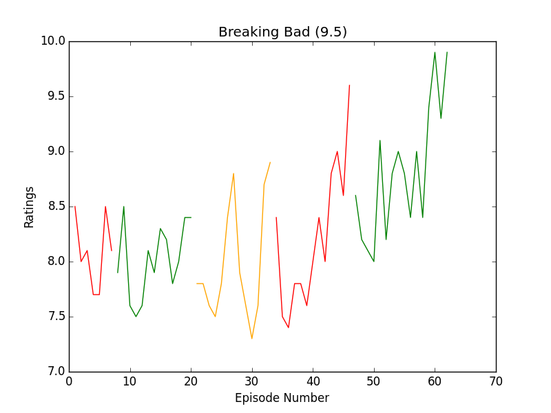

Tvstats
*******
Scrape data of all the episodes of a Tv Series from IMDB.

Installation
============
tvstats can be installed using pip
::

    pip install tvstats

Dependencies
============
tvstats is based on Python 2.7. Requires ``BeautifulSoup4`` for parsing, ``requests`` for downloading html.
``Matplotlib`` is required(optional) for using graph module.

Usage
=====
Run the simple command
::

    tvstats url

to generate json data.
URL should point to homepage of a tv series. eg. http://www.imdb.com/title/tt0108778/?ref_=fn_al_tt_1

For options and help run
::

    tvstats -h

Why?
====
Here are my reasons:

* I was bored and had time to kill.
* I love watching Tv Series. Thought it would be good to analyse some data
  before starting a new one.
* Graphs are fun.
* Lastly, I wanted to test out ``BeautifulSoup4`` :).

Examples
========
.. |here| replace:: data/jsonData
.. |Graphs| replace:: data/graphs

All the datasets can be found |here|. |Graphs| were made using ``graph`` function in 'graph.py'.

Friends
-------

Game Of Thrones
---------------

.. image:: data/graphs/gameOfThrones.png

Breaking Bad
-------------

Bugs
====
.. |issues| replace:: https://github.com/leosartaj/tvstats/issues

For filing bugs raise an issue at |issues|
